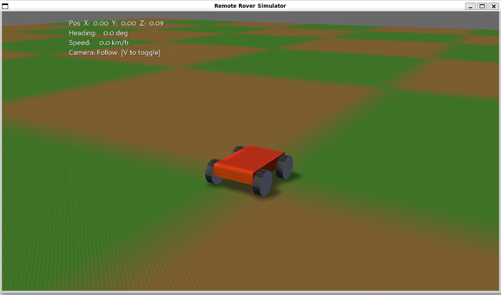

# Phase 1 — 3D Rover Simulator

> Part of the Remote Rover project (Phases 1–4).
> This document describes everything currently implemented in the standalone Python desktop simulator.

---

## Overview

A real-time 3D rover simulator built with **Python + Panda3D + panda3d.bullet**. The rover drives over procedurally generated terrain with realistic terrain-conformance (all four wheels stay on the ground at all times), directional sunlight and shadow, an orbital follow camera, a POV offscreen camera, and a live telemetry HUD.

No networking (MQTT/WebSocket) is implemented in Phase 1. The rover is driven by keyboard only.

---

## How to Run

```bash
# Install dependencies
pip install -r requirements.txt

# Run
python simulator/main.py
```

---

## Controls

| Key | Action |
|-----|--------|
| ↑ | Throttle forward |
| ↓ | Throttle backward |
| ← | Steer left |
| → | Steer right |
| Right-click + drag | Orbit follow camera |
| Scroll wheel | Zoom follow camera in/out |
| V | Toggle follow cam / POV cam |
| Escape | Quit |

---

## File Structure

```
simulator/
├── main.py       — ShowBase entry point, lighting, scene wiring, game loop
├── terrain.py    — Procedural heightmap terrain (visual + physics)
├── rover.py      — Rover mesh, kinematic physics, terrain conformance
├── camera.py     — Orbital follow camera + POV offscreen camera
└── gui.py        — DirectGUI telemetry HUD overlay
```

---

## Implementation Details

### `main.py` — Entry Point & Scene

- Subclasses Panda3D `ShowBase`.
- **Window**: 1280×720, titled "Remote Rover Simulator".
- **Lighting**:
  - Dim ambient light (`LColor(0.22, 0.25, 0.30, 1)`) for visible shadow contrast.
  - Directional sun light (`LColor(1.15, 1.05, 0.90, 1)`) with shadow map (`2048×2048`, film size `30×30` for sharp rover shadow).
  - Shadow camera follows the rover every frame so the tight shadow film window stays centred over it regardless of where the rover has driven.
- **Sun disc**: A billboard `CardMaker` quad placed far in the sky at `Point3(-70, -90, 130)`, with a second larger translucent glow quad behind it. Both are hidden from shadow cameras (`hide(BitMask32.allOn())` + `show(main_mask)`) so they cast no shadow.
- **Shader**: `render.setShaderAuto()` enables Panda3D's built-in shadow-map shader on all geometry.
- **Terrain shadow**: The terrain is hidden from shadow cameras (`terrain.np.hide(allOn)` + `show(main_mask)`) so the terrain does not shadow itself — only the rover casts a shadow onto the terrain.
- **Game loop**: Single `taskMgr` task `_update` runs at display frame rate:
  1. Reads key map → sets `rover.throttle` and `rover.steering` (−1 / 0 / 1).
  2. Steps Bullet physics world (`doPhysics`).
  3. Calls `rover.update(dt)`.
  4. Moves shadow camera to track rover.
  5. Updates follow / POV cameras.
  6. Updates telemetry HUD.

---

### `terrain.py` — Procedural Terrain

#### Heightmap

Generated by `_build_heightmap()` using two overlapping sine waves:

```python
h = (sin(x * 3.5) * cos(y * 3.0) * 0.18 +
     sin(x * 7.0 + 1.0) * sin(y * 6.0) * 0.06)
```

- `x`, `y` in `[0, 1]` (normalised over the terrain grid).
- Height amplitude: ≈ ±0.24 world units — gentle rolling surface.
- Grid: 80 × 80 vertices → 79 × 79 tiles over a 100 m × 100 m field.

#### Visual Mesh

- Format: `v3n3c4` (position + per-vertex normal + colour).
- Normals computed via finite differences from the heightmap.
- Checkerboard colouring: alternating green (`0.28, 0.52, 0.18`) and tan/brown (`0.55, 0.42, 0.22`) in 8-tile blocks — makes movement direction clearly visible while driving.
- `setTwoSided(True)` prevents back-face culling artifacts.

#### Physics Heightfield

- Heights encoded into a `PNMImage` (8-bit grey, `[0, 1]` maps to `[−half_range, +half_range]`).
- `BulletHeightfieldShape(img, half_range, ZUp)` with `setUseDiamondSubdivision(True)`.
- Physics body scaled to world space: `setScale(TERRAIN_SIZE/(n−1), TERRAIN_SIZE/(n−1), 1.0)`.
- Body positioned at `Z = mid_h` so Bullet's centred heightfield aligns with the visual mesh.
- Collision mask: default `allOn` — included in all raycasts.

---

### `rover.py` — Rover

#### Dimensions & Constants

| Parameter | Value | Notes |
|-----------|-------|-------|
| `HALF_W` | 0.4 m | Half body width |
| `HALF_L` | 0.6 m | Half body length |
| `HALF_H` | 0.11 m | Half body height |
| `WHEEL_RADIUS` | 0.225 m | 1.5× original size |
| `WHEEL_WIDTH` | 0.14 m | |
| `_WHEEL_Z` | 0.145 m | Local Z of wheel centre from chassis centre |
| `_WHEEL_X` | 0.49 m | Local X of wheel centre |
| `_WHEEL_Y` | 0.42 m | Local Y of wheel centre |
| `ACCELERATION` | 6.0 m/s² | Throttle gain |
| `MAX_SPEED` | 5.0 m/s | ≈ 18 km/h |
| `FRICTION` | 5.0 m/s² | Coast deceleration |
| `TURN_RATE` | 75 °/s | Yaw rate |

#### Visual Geometry

**Body** — `_build_body_node()`:
- 6-face box (`v3n3c4` format) with per-face flat normals.
- Front face (−Y) is slightly brighter orange-red; sides and top/bottom are darker shades.
- Attached to `chassis_np`, raised by `_WHEEL_Z + HALF_H` so the bottom of the body sits at wheel-axle height (body floats above ground on the wheels).

**Wheels** — `_build_wheel_node(name)` (× 4):
- Cylinder built along the X axis (16 segments), with alternating dark segments for a tread pattern.
- Hub discs on both sides in a light grey-silver colour.
- Attached to `chassis_np` at `WHEEL_OFFSETS[i]`.
- Each frame: `wheel_np.setP(wheel_angle)` spins the wheel around the X axis (correct rolling axis).
- Spin rate proportional to `forward · velocity / WHEEL_RADIUS`, direction matches forward/backward motion.

#### Physics Body

- `BulletBoxShape(Vec3(HALF_W, HALF_L, HALF_H))` — matches visual body extents.
- `BulletRigidBodyNode` with `setMass(1.0)` and `setKinematic(True)`.
  - Kinematic means the rover position/orientation is controlled entirely in code; Bullet only uses it for collision queries.
- `setIntoCollideMask(BitMask32(0x2))` — the rover body is **excluded** from terrain-height raycasts (mask `0x1`) so the rover cannot accidentally hit its own physics shape when sampling ground height.

#### Movement Model

Each frame `update(dt)`:

1. **Forward direction** — computed from heading H only (ignoring pitch/roll to keep velocity horizontal):
   ```python
   h_rad  = radians(chassis_np.getH())
   forward = Vec3(-sin(h_rad), cos(h_rad), 0)
   ```

2. **Velocity integration**:
   - Throttle ≠ 0: `vel += forward * throttle * ACCELERATION * dt`, clamped to `MAX_SPEED`.
   - Throttle = 0: apply friction deceleration in velocity direction; zero out when speed < 1 mm/s.

3. **Steering**: directly add `steering * TURN_RATE * dt` to heading H (yaw-only, no drift).

4. **Horizontal translation**: `setPos(pos.x + vel.x*dt, pos.y + vel.y*dt, pos.z)` — Z unchanged here, set by conformance below.

5. **Terrain conformance** (`_conform_to_terrain`): see below.

6. **Wheel spin**: `wheel_angle -= (forward·vel) * dt / WHEEL_RADIUS * (180/π)`, applied as `setP(wheel_angle)`.

#### Terrain Conformance (`_conform_to_terrain`)

Called every frame after horizontal movement. Keeps all four wheels touching the ground.

**Wheel world positions** — rotated by heading H only:
```python
wx = pos.x + off.x * cos(H) + off.y * sin(H)
wy = pos.y − off.x * sin(H) + off.y * cos(H)
```

**Terrain height raycasts** — one per wheel, downward:
```python
world.rayTestClosest(
    Point3(wx, wy, near_z + 2.0),
    Point3(wx, wy, near_z − 6.0),
    BitMask32(0x1)   # terrain only, skip rover body
)
```
Falls back to `near_z` on miss (terrain edge).

**Chassis Z**:
```python
avg_ground = (fl + fr + rl + rr) / 4
target_z   = avg_ground + WHEEL_RADIUS − _WHEEL_Z
```

**Pitch** (front–rear tilt):
```python
pitch = degrees(atan2(rear_h − front_h, 2 * _WHEEL_Y))
```
Positive pitch tilts +Y (physical-forward) upward — correct for climbing.

**Roll** (left–right tilt):
```python
roll = −degrees(atan2(right_h − left_h, 2 * _WHEEL_X))
```
Negated because positive Panda3D R tilts +X (right) downward.

`setPos` and `setHpr` applied in one step.

> **Collision mask note**: at certain headings (≈56°) the rover's rotated bounding box extends past the wheel X sample positions. Without the `BitMask32(0x1)` filter the raycast would hit the rover's own body top (Z ≈ +0.19) instead of the terrain (Z ≈ 0), causing 10–20× exaggerated pitch/roll. The mask fix eliminates this.

---

### `camera.py` — Camera Controller

Two cameras share the same scene graph.

#### Follow Camera (default)

- Panda3D's built-in `base.camera`, FOV 60°, near 0.1, far 500.
- Spherical orbit around rover: azimuth + elevation in degrees, distance in metres.
- **Right-click drag**: changes azimuth (left/right orbit) and elevation (up/down orbit).
- **Scroll wheel**: zoom in/out (`ZOOM_STEP = 1.2×` per click), clamped to `[2, 30]` m.
- Camera looks at `pos + (0, 0, 0.5)` — slightly above rover centre.

| Parameter | Value |
|-----------|-------|
| Default distance | 8 m |
| Distance range | 2 – 30 m |
| Default elevation | 20° |
| Elevation range | 3° – 85° |
| Orbit sensitivity | 0.3 °/pixel |

#### POV Camera (V to toggle)

- Separate `Camera` node with `PerspectiveLens`, FOV 90°.
- Mounted at rover front: `pos + forward * 0.65 + up * 0.25`.
- Renders into a `640×480` offscreen `GraphicsBuffer` — the buffer is inert until toggled on (ready for Phase 2 JPEG frame capture via `pov_buffer`).
- When POV is active the main follow camera also moves to the same position/HPR, so the main window shows the POV view.

---

### `gui.py` — Telemetry HUD

Four `OnscreenText` fields in the top-left corner, updated every frame:

| Field | Content |
|-------|---------|
| Pos | `X`, `Y`, `Z` in metres (2 decimal places) |
| Heading | Degrees (1 decimal place) |
| Speed | km/h (1 decimal place) |
| Camera | "Follow" or "POV" with toggle hint |

White text with dark drop shadow; `scale = 0.05`.

---

## Known Issues / Limitations (as of Phase 1)

- **No suspension spring**: terrain conformance is instantaneous (snaps to target each frame). No bounce/damping on bumps — planned for a future iteration.
- **Terrain is very gentle** (max amplitude ±0.24 m over 100 m). Hills and valley variation are subtle. Stone/boulder obstacles are not yet added.
- **Kinematic physics only**: the rover has no dynamic mass interaction with the world. It cannot be pushed by objects or respond to collisions physically.
- **No MQTT / networking**: keyboard-only control. Phase 2 will add paho-mqtt publish/subscribe.
- **POV buffer inactive**: the offscreen buffer exists and is wired up, but no frame capture or streaming is implemented yet.

---

## Upcoming Work (Phase 2)

- Larger terrain features: hills, valleys, rock/boulder obstacles comparable to rover size.
- Suspension simulation: per-wheel spring-damper giving a bouncy chassis response to terrain changes.
- MQTT integration: publish telemetry + JPEG POV frames; subscribe to throttle/steering/brake control topics.
- DirectGUI settings panel: broker URL, port, topic prefix, persisted to `config.json`.

---

## Dependencies

```
panda3d>=1.10
```

All physics (`panda3d.bullet`) and GUI (`direct`) components are bundled with the standard Panda3D distribution — no separate PyPI packages needed.

## Demo Video

## Rover Simulator Demo

  Watch the rover being controlled via keyboard input in the 3D simulation environment.

[](https://youtu.be/PBMAYspwNwU)

